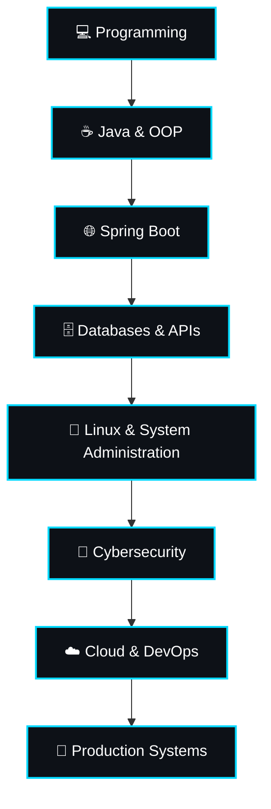

#  Welcome to Rohan's Digital Universe

<div align="center">


<br>


<br><br>

<a href="https://github.com/RoyalRohan">

</a>

<a href="https://github.com/RoyalRohan?tab=repositories">

</a>

<a href="https://www.ghimirerohan.com.np">

</a>

<br><br>


</div>

---

##  About Me


```python
class RohanProfile:
    def __init__(self):
        self.name = "Rohan Ghimire"
        self.username = "RoyalRohan"
        self.role = "Software Developer & Cybersecurity Enthusiast"
        self.location = "Nepal 🇳🇵"
        self.education = "BCA-IT"

        self.interests = [
            "Software Development",
            "Cybersecurity",
            "Linux",
            "Automation",
            "Self-Hosting",
            "DevOps"
        ]

    def current_focus(self):
        return {
            "building": [
                "Web Applications",
                "Backend Systems",
                "Cloud Infrastructure",
                "Automation Tools"
            ],
            "learning": [
                "Java",
                "Spring Boot",
                "Cybersecurity",
                "Linux Administration",
                "DevOps"
            ],
            "exploring": [
                "Ethical Hacking",
                "Open Source",
                "Cloud Infrastructure",
                "System Security"
            ]
        }

    def philosophy(self):
        return "Build it. Secure it. Automate it. 🚀"


me = RohanProfile()
```

<div align="center">


</div>

---

##  Tech Arsenal

### 💻 Software Development

<div align="center">


</div>

### 🔒 Cybersecurity & System Administration

<div align="center">


</div>

### ☁️ Cloud, DevOps & Infrastructure

<div align="center">


</div>

<div align="center">


</div>

---

# 📊 GitHub Analytics

<div align="center">


<br>


</div>

<br>

<div align="center">


</div>

---

## 📈 GitHub Activity

<div align="center">


</div>

---

## 🐍 Contribution Snake

<div align="center">


</div>

---

# 🚀 Featured Projects

<div align="center">

## ☁️ RoyalRohan Cloud

**My personal self-hosted cloud infrastructure.**

RoyalRohan Cloud is my private cloud environment built around self-hosting, containerization, secure remote access and infrastructure management.

### ⚙️ Infrastructure


<br><br>

<a href="https://www.ghimirerohan.com.np">

</a>

</div>

<br>

<div align="center">

## 🔐 Royal FGA Platform

**A security-focused platform built for controlled cookie management and distribution.**

Royal FGA Platform is one of my major platform projects, focused on controlled access, management workflows, distribution features and an administrative interface.

### ⚙️ Platform


<br><br>

<a href="https://www.ghimirerohan.com.np">

</a>

</div>

<br>

<div align="center">

<a href="https://www.ghimirerohan.com.np">

</a>

</div>

---

# 🧠 Current Learning Journey

<div align="center">


```mermaid
graph TD
    A[💻 Programming] --> B[☕ Java & OOP]
    B --> C[🌐 Spring Boot]
    C --> D[🗄️ Databases & APIs]
    D --> E[🐧 Linux & System Administration]
    E --> F[🔐 Cybersecurity]
    F --> G[☁️ Cloud & DevOps]
    G --> H[🚀 Production Systems]

    classDef cyan fill:#00d9ff,stroke:#ffffff,stroke-width:2px,color:#000000;
    classDef dark fill:#0d1117,stroke:#00d9ff,stroke-width:2px,color:#ffffff;

    class A,B,C,D,E,F,G,H dark;
```

</div>

---

# 🏆 GitHub Achievements

<div align="center">


</div>

---

# 📈 Live GitHub Profile Metrics

<div align="center">


<br><br>

<a href="https://github.com/RoyalRohan?tab=repositories">

</a>

<a href="https://github.com/RoyalRohan?tab=followers">

</a>

<a href="https://github.com/RoyalRohan?tab=stars">

</a>

</div>

---

# 🤝 Let's Connect & Collaborate

<div align="center">

### Have an idea? Let's build it.

<br>

<a href="https://github.com/RoyalRohan">

</a>

<a href="https://www.linkedin.com/in/rohan-ghimire-b157233b1/">

</a>

<a href="https://x.com/rohan_ghimire69">

</a>

<a href="mailto:rohanxett6@gmail.com">

</a>

<a href="https://www.ghimirerohan.com.np">

</a>

<br><br>


</div>

---

# 🌐 Find Me Online

<div align="center">

| Platform | Link |
|:---:|:---:|
| 💻 GitHub | [@RoyalRohan](https://github.com/RoyalRohan) |
| 🌐 Portfolio | [ghimirerohan.com.np](https://www.ghimirerohan.com.np) |
| 💼 LinkedIn | [Rohan Ghimire](https://www.linkedin.com/in/rohan-ghimire-b157233b1/) |
| 𝕏 X | [@rohan_ghimire69](https://x.com/rohan_ghimire69) |
| 📧 Email | [rohanxett6@gmail.com](mailto:rohanxett6@gmail.com) |

</div>

---

<div align="center">


<br>

<i>"The best way to predict the future is to create it." — Alan Kay</i>

<br><br>

<b>⭐ Explore my repositories and follow my journey.</b>

</div>
