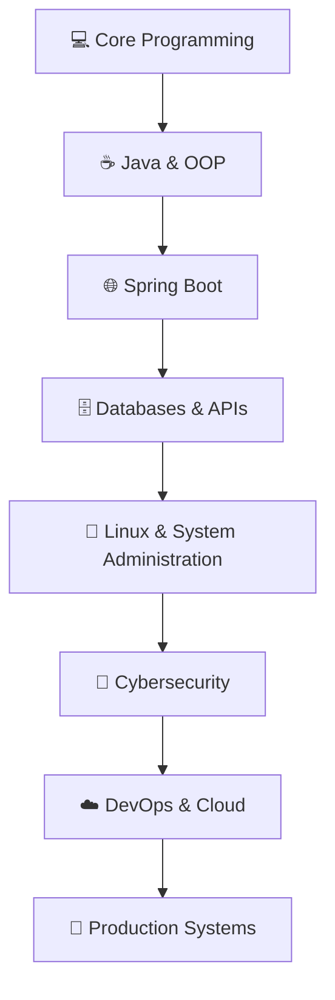

#  Welcome to Rohan's Digital Universe

<div align="center">


</div>

<div align="center">


</div>

<div align="center">


</div>

---

##  About Me


```python
class RohanProfile:
    def __init__(self):
        self.name = "Rohan Ghimire"
        self.role = "Software Developer & Cybersecurity Enthusiast"
        self.location = "Nepal 🇳🇵"
        self.education = "BCA-IT"
        self.interests = [
            "Software Development",
            "Cybersecurity",
            "Linux",
            "Automation",
            "Self-Hosting"
        ]

    def current_focus(self):
        return {
            "building": [
                "Web Applications",
                "Backend Systems",
                "Automation Tools",
                "Developer Projects"
            ],
            "learning": [
                "Java",
                "Spring Boot",
                "Cybersecurity",
                "Linux & System Administration",
                "DevOps"
            ],
            "exploring": [
                "Ethical Hacking",
                "Open Source",
                "Cloud & Self-Hosting",
                "Infrastructure Security"
            ]
        }

    def philosophy(self):
        return "Build it. Secure it. Automate it. 🚀"


me = RohanProfile()
```

<div align="center">


</div>

---

##  Tech Arsenal

### 💻 Software Development

<div align="center">


</div>

### 🔒 Cybersecurity & System Administration

<div align="center">


</div>

### ☁️ DevOps, Cloud & Infrastructure

<div align="center">


</div>

<div align="center">


</div>

---

##  GitHub Analytics

<div align="center">


</div>

<br>

<div align="center">


</div>

---

###  Activity Graph

<div align="center">


</div>

---

##  Contribution Snake

<div align="center">


</div>

---

##  Featured Projects

<div align="center">

### 🛒 E-Commerce App

Full-featured e-commerce mobile application focused on real-time inventory, authentication, and secure payment integration.

**Flutter • Firebase • Dart**

<a href="https://www.ghimirerohan.com.np/#projects">

</a>

---

### 🛡️ Security Scanner

Automated vulnerability scanning project designed to identify common web application security issues and generate reports.

**Python • Java • Docker**

<a href="https://www.ghimirerohan.com.np/#projects">

</a>

---

### ⚙️ Task Manager API

REST API featuring task management, JWT authentication, role-based access control, and API documentation.

**Spring Boot • MySQL • JWT**

<a href="https://www.ghimirerohan.com.np/#projects">

</a>

---

### 🤖 Automation Bot

Automation-focused application designed to simplify repetitive tasks through scheduling and notification capabilities.

**Kotlin • Android • Firebase**

<a href="https://www.ghimirerohan.com.np/#projects">

</a>

---

### 💬 Chat Application

Real-time communication application with messaging, group conversations, file sharing, and secure communication features.

**Flutter • Firebase • WebSocket**

<a href="https://www.ghimirerohan.com.np/#projects">

</a>

---

### 📊 Analytics Dashboard

Analytics dashboard focused on data visualization, real-time updates, and customizable reporting.

**Spring Boot • React • MySQL**

<a href="https://www.ghimirerohan.com.np/#projects">

</a>

</div>

<br>

<div align="center">

<a href="https://www.ghimirerohan.com.np/#projects">

</a>

<a href="https://github.com/RoyalRohan?tab=repositories">

</a>

</div>

---

##  Current Learning Journey

<div align="center">


```mermaid
graph TD
    A[💻 Core Programming] --> B[☕ Java & OOP]
    B --> C[🌐 Spring Boot]
    C --> D[🗄️ Databases & APIs]
    D --> E[🐧 Linux & System Administration]
    E --> F[🔐 Cybersecurity]
    F --> G[☁️ DevOps & Cloud]
    G --> H[🚀 Production Systems]
```

</div>

---

##  Let's Connect & Collaborate

<div align="center">

<a href="https://www.linkedin.com/in/rohan-ghimire-b157233b1/">

</a>

<a href="https://x.com/rohan_ghimire69">

</a>

<a href="mailto:rohanxett6@gmail.com">

</a>

<a href="https://github.com/RoyalRohan">

</a>

<a href="https://www.ghimirerohan.com.np">

</a>

</div>

<div align="center">


</div>

---

##  GitHub Achievements & Activity

<div align="center">


</div>

<br>

### 🏆 GitHub Trophies

<div align="center">


</div>

---

## 📈 GitHub Contribution Calendar

<div align="center">


</div>

---

<div align="center">


</div>

<div align="center">

<i>"The best way to predict the future is to create it." — Alan Kay</i>

<br><br>

<b>⭐ Explore my repositories and follow my journey!</b>

</div>
