```mermaid
graph TD
    A[💻 Core Java & OOP] --> B[📱 Android Development]
    B --> C[🦋 Flutter & Cross-Platform Apps]
    C --> D[🌐 Backend with Spring Boot]
    D --> E[☁️ Cloud & Firebase Integration]
    E --> F[🚀 DevOps & CI/CD]
    
    style A fill:#00d9ff,stroke:#fff,stroke-width:2px,color:#000
    style B fill:#6c5ce7,stroke:#fff,stroke-width:2px,color:#000
    style C fill:#00b894,stroke:#fff,stroke-width:2px,color:#000
    style D fill:#0984e3,stroke:#fff,stroke-width:2px,color:#000
    style E fill:#fdcb6e,stroke:#fff,stroke-width:2px,color:#000
    style F fill:#e17055,stroke:#fff,stroke-width:2px,color:#000
```

#  Welcome to Rohan's Digital Universe
<div align="center">
  
</div>

<div align="center">
  
</div>

<div align="center">
  
</div>

##  About Me


```python
class RohanProfile:
    def __init__(self):
        self.name = "Rohan"
        self.role = "Software Developer and Cyber Security Enthusiast"
        self.location = "Nepal 🇳🇵"
        self.education = "BCA-IT"
        self.passion = ["Software Development", "Cybersecurity", "Automation"]
        
    def current_focus(self):
        return {
            "learning": [""],
            "building": ["telegram Bots", "Automation Tools", "Apps"],
            "exploring": ["Ethical Hacking", "open-source and Linux tools"]
        }
    
    def fun_fact(self):
        return "I've automated my coffee brewing process! ☕🤖"

# Initialize profile
me = RohanProfile()
```

<div align="center">
  
</div>

##  Tech Arsenal

### 💻 Software Development

<div align="center">
  


</div>

### 🔒 **Cybersecurity & System Administration**
<div align="center">
  


</div>

### ☁️ **DevOps & Cloud**
<div align="center">
  


</div>

<div align="center">
  
</div>

##  GitHub Analytics

<div align="center">
   
  
</div>

<div align="center">
  
</div>

###  Activity Graph
<div align="center">
  
</div>

##  Contribution Snake
<div align="center">
  
</div>


##  Featured Projects

<div align="center">
  
[](https://github.com/RoyalRohan/AI-ChatBot)
[](https://github.com/RoyalRohan/ML-AutomationSuite)

</div>

##  Current Learning Journey

<div align="center">
  


</div>

##  Let's Connect & Collaborate

<div align="center">
  
[](https://linkedin.com/in/yourprofile)
[](https://twitter.com/yourhandle)
[](mailto:rohanxett6@gmail.com)
[](https://github.com/RoyalRohan)
[](https://your-portfolio.com)

</div>

<div align="center">
  
</div>

##  Fun Stats & Achievements

<div align="center">
  


</div>

### 🏆 GitHub Achievements
<div align="center">
  
</div>

---

<div align="center">
  
</div>

<div align="center">
  <i>"The best way to predict the future is to create it." - Alan Kay</i>
  <br><br>
  <b>⭐ Don't forget to star my repositories if you find them interesting!</b>
</div>
